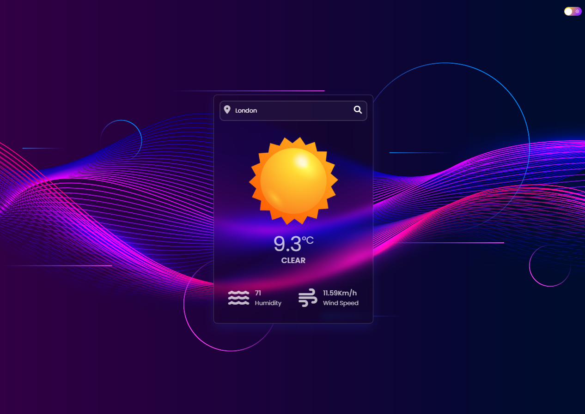
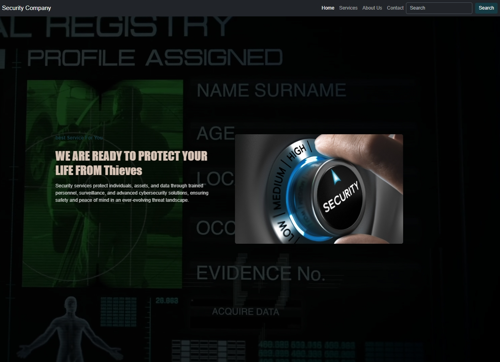
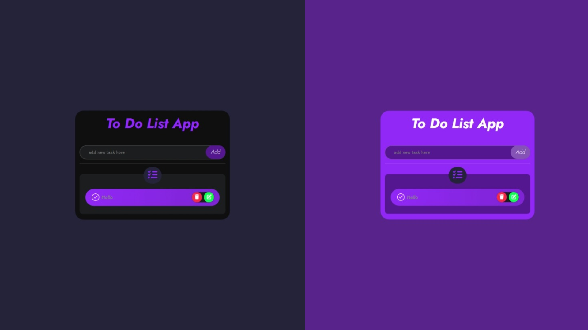

  

  
  
  
  

  <h2>💫 Welcome to my coding universe! 💫</h2>
  

##  About Me

> *"Building the web, one pixel-perfect interface at a time."*

I'm a **Front-End Developer** with a passion for creating intuitive and engaging web experiences. With a strong foundation in HTML, CSS, and JavaScript, I transform design concepts into responsive, interactive interfaces that users love.

- 🔭 Currently working on expanding my React.js expertise
- 🌱 Learning advanced JavaScript frameworks and libraries
- 💬 Ask me about responsive design and front-end optimization
- ⚡ Fun fact: I debug with rubber duck debugging technique!

---

  

##  Skills & Technologies

  
  ### 🚀 Frontend Technologies
  
  

    
    
    
    
    
    
    
    
  

  
  ### 🛠️ Tools & Platforms
  
  

    
    
    
    
    
    
    
  

---

##  GitHub Analytics

  

  
  

  

  

---

##  Featured Projects

  

    <table>
      <tr>
        <td width="50%">
          <h3 align="center">Weather App</h3>
          
  
            
             
             
            

                
              
            

            

              <strong>HTML, CSS, JavaScript & Weather API</strong> - Interactive weather application with real-time updates, location search, responsive design, and dynamic weather icons based on conditions.
            

          

        </td>
        <td width="50%">
          <h3 align="center">Security Company Website</h3>
          
  
            
             
             
            

                
              
            

            

              <strong>HTML, CSS & Bootstrap</strong> - Professional security company website featuring modern design, service showcases, animated transitions, and fully responsive layout across all devices.
            

          

        </td>
      </tr>
      <tr>
        <td width="50%">
          <h3 align="center">To-Do App</h3>
          
  
            
             
             
            

                
              
            

            

              <strong>HTML, CSS & JavaScript</strong> - Feature-rich task management application with local storage functionality, task categorization, drag-and-drop interface, and clean, intuitive design.
            

          

        </td>
        <td width="50%">
          <h3 align="center">Coming Soon: Portfolio Website</h3>
          
  
            
             
             
            

              
            

            

              <strong>HTML, CSS, JavaScript & React</strong> - My personal portfolio website showcasing all my projects, skills, and professional journey. Coming soon with advanced animations and interactive elements!
            

          

        </td>
      </tr>
    </table>
  

---

##  Connect With Me

  
Let's connect and discuss how we can work together!

  
  
  
  
  
  
💬 Feel free to reach out for collaborations or just a friendly chat!

---

  

  <h3>⚡ Front-end development is an art, and I'm painting the web! ⚡</h3>
  

