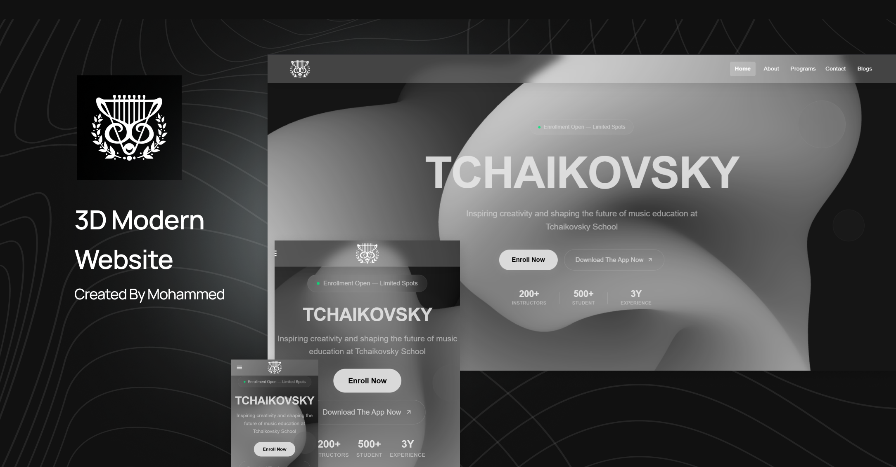
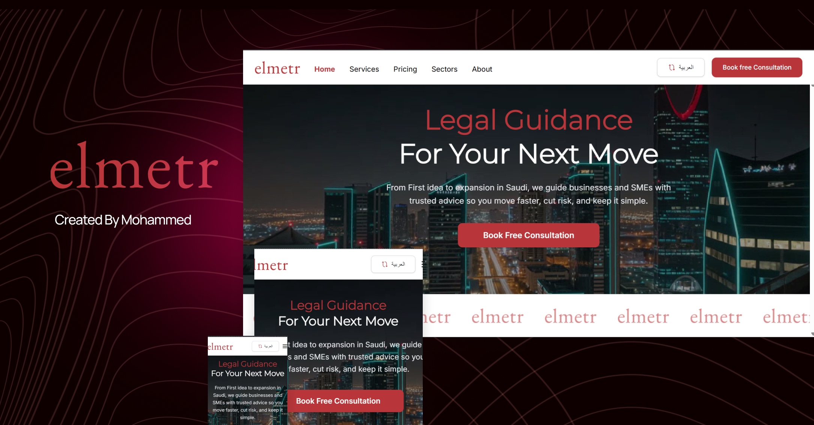
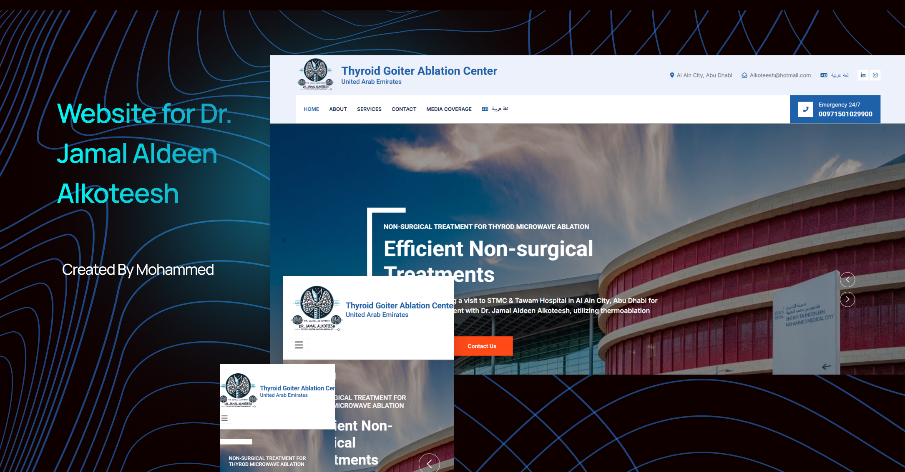

  
  
  
  

  <h2>💫 Welcome to my coding universe! 💫</h2>
  

##  About Me

> *"Building the web, from backend to pixel-perfect interfaces."*

I'm a **Full-Stack Developer** with a deep commitment for creating intuitive and scalable web experiences. With expertise spanning frontend, backend, mobile development, and 3D web graphics, I transform ideas into powerful, responsive applications that users love.

- 🔭 Currently working on immersive 3D web experiences with Three.js
- 🌱 Mastering full-stack development with React, Node.js, Express, Laravel
- 📱 Building cross-platform mobile applications with React Native
- 💬 Ask me about responsive design, REST APIs, and modern web architecture
- ⚡ Fun fact: I debug with rubber duck debugging technique!

---

  

##  Skills & Technologies

  
  ### 🎨 Frontend Technologies
  
  

    
    
    
    
    
    
    
    
    
  

  
  ### ⚙️ Backend Technologies
  
  

    
    
    
    
    
    
    
  

  ### 📱 Mobile Development
  
  

    
    
  

  
  ### 🛠️ Tools & Platforms
  
  

    
    
    
    
    
    
    
  

---

##  GitHub Analytics

  

  
  

  

  

---

##  Featured Projects

  

    <table>
      <tr>
        <td width="50%">
          <h3 align="center">Tchaikovsky School</h3>
          
  
             
              
             
            

              
                
            

            

              <strong>React, Node.js, Express & MySQL</strong> - Comprehensive educational platform with student management system, course enrollment, interactive dashboards, and real-time notifications. Features secure authentication and role-based access control.
            

          

        </td>
        <td width="50%">
          <h3 align="center">Elmetr Platform</h3>
          
  
            
             
             
            

              
                
            

            

              <strong>Laravel, PHP, MySQL & Bootstrap</strong> - Enterprise-level business platform featuring complex data management, multi-user authentication, analytics dashboard, and RESTful API integration. Built with MVC architecture for scalability.
            

          

        </td>
      </tr>
      <tr>
        <td width="50%">
          <h3 align="center">Dr. Jamal Eldeen Website</h3>
          
  
            
             
             
            

                
              
            

            

              <strong>HTML5, CSS3, JavaScript & jQuery</strong> - Professional medical website with appointment booking system, patient information portal, interactive service showcases, and fully responsive design optimized for all devices.
            

          

        </td>
        <td width="50%">
          <h3 align="center">Rowad Holding</h3>
          
  
            
             
             
            

                
              
            

            

              <strong>React, Three.js, Tailwind CSS & Node.js</strong> - Modern corporate website featuring stunning 3D elements, smooth animations, dynamic portfolio showcase, and immersive user experience built with cutting-edge web technologies.
            

          

      </tr>
    </table>
  

---

##  Connect With Me

  
Let's connect and discuss how we can work together!

  
  
  
  
  
  
💬 Feel free to reach out for collaborations or just a friendly chat!

---

  

  <h3>⚡ Full-stack development is an art, and I'm architecting the future! ⚡</h3>
  

