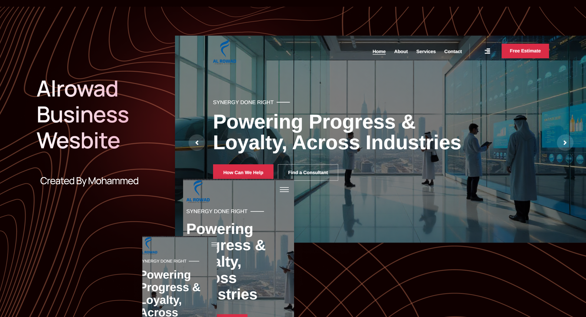

 

---

## About Me

> *"Building the web, from backend to pixel-perfect interfaces."*

I'm a Full-Stack Developer committed to crafting web experiences that are fast, intentional, and visually sharp. My work spans the full stack — from database architecture to interactive 3D interfaces — and I care deeply about every layer in between.

- Currently building immersive 3D web experiences with **Three.js**
- Deepening expertise across **React, Node.js, Express**, and **Laravel**
- Developing cross-platform mobile applications with **React Native**
- Focused on responsive design, REST API architecture, and modern web patterns

> Click to watch my coding journey

---

## Skills & Technologies

### Frontend

### Backend

### Mobile

### Tools & Platforms

---

## GitHub Analytics

 

&nbsp;&nbsp;

---

## Featured Projects

<table>
  <tr>
    <td width="50%">
      <h3 align="center">Tchaikovsky School</h3>
      

        
          
        
        
        
<strong>Next.js · Three.js · CMS</strong> — Full educational platform with student management, course enrollment, interactive dashboards, and real-time notifications. Secure authentication and role-based access built in from the ground up.

      

    </td>
    <td width="50%">
      <h3 align="center">Elmetr Platform</h3>
      

        
          
        
        
        
<strong>Next.js · Tailwind CSS</strong> — Enterprise-level business platform with complex data management, multi-user authentication, analytics dashboard, and RESTful API integration built on MVC architecture for long-term scalability.

      

    </td>
  </tr>
  <tr>
    <td width="50%">
      <h3 align="center">Dr. Jamal Eldeen — UAE Medical Center</h3>
      

        
          
        
        
        
<strong>HTML5 · CSS3 · JavaScript · jQuery</strong> — Professional medical website with appointment booking, patient information portal, and fully responsive design optimized across all devices. Clean, fast, and purposeful.

      

    </td>
    <td width="50%">
      <h3 align="center">Rowad Holding</h3>
      

        
          
        
        
        
<strong>HTML · Bootstrap · JavaScript</strong> — Corporate identity site with 3D elements, smooth scroll animations, and a dynamic portfolio showcase. Built with layered motion work for a striking first impression.

      

    </td>
  </tr>
</table>

---

## Connect With Me

Let's connect and build something great together.

 

&nbsp;

&nbsp;

---

